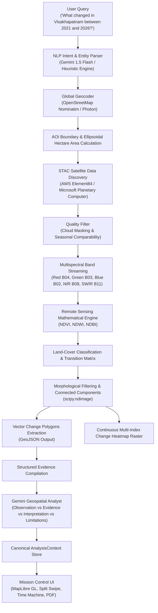

# EARTHSCOPE — ARCHITECTURE SPECIFICATION
**Autonomous Earth Intelligence Engine**
*"Ask a place. See what changed. Understand why."*

---

## 1. System Architecture Overview

EarthScope transforms complex satellite remote sensing workflows into an autonomous, conversational pair-analyst. Traditional Earth observation requires manual GIS coordinates determination, satellite archive queries, band calibration, index computation, cloud masking, land-cover classification, and manual interpretation. EarthScope automates the complete pipeline end-to-end.

---

## 2. Remote-Sensing Mathematical Formulation

### 2.1 Spectral Indices
EarthScope implements scientific multispectral equations operating on top-of-atmosphere surface reflectance:

1. **Normalized Difference Vegetation Index (NDVI)**
   $$\text{NDVI} = \frac{\text{NIR} - \text{Red}}{\text{NIR} + \text{Red} + \epsilon}$$
   - *Sensor Bands:* Sentinel-2 Band 8 (842 nm) and Band 4 (665 nm).
   - *Interpretation:* Sensitive to chlorophyll concentration and photosynthetic biomass. Ranges $[-1.0, 1.0]$. Healthy canopy typically exhibits $\text{NDVI} \ge 0.40$.

2. **Normalized Difference Water Index (NDWI)**
   $$\text{NDWI} = \frac{\text{Green} - \text{NIR}}{\text{Green} + \text{NIR} + \epsilon}$$
   - *Sensor Bands:* Sentinel-2 Band 3 (560 nm) and Band 8 (842 nm).
   - *Interpretation:* Highlights open liquid water surfaces by leveraging water's strong near-infrared absorption. Ranges $[-1.0, 1.0]$.

3. **Normalized Difference Built-up Index (NDBI)**
   $$\text{NDBI} = \frac{\text{SWIR} - \text{NIR}}{\text{SWIR} + \text{NIR} + \epsilon}$$
   - *Sensor Bands:* Sentinel-2 Band 11 (1610 nm) and Band 8 (842 nm).
   - *Interpretation:* Accentuates impervious man-made surfaces, asphalt, and concrete structures. Ranges $[-1.0, 1.0]$.

### 2.2 Change Magnitude & Heatmap Vectorization
Rather than simple RGB pixel subtraction, EarthScope computes a true multi-spectral divergence magnitude $M(x, y)$:

$$M(x, y) = \sqrt{w_{\text{ndbi}}(\Delta \text{NDBI})^2 + w_{\text{ndvi}}(\Delta \text{NDVI})^2 + w_{\text{ndwi}}(\Delta \text{NDWI})^2}$$

Where:
- $\Delta \text{NDVI} = \text{NDVI}_{\text{after}} - \text{NDVI}_{\text{before}}$
- $\Delta \text{NDBI} = \text{NDBI}_{\text{after}} - \text{NDBI}_{\text{before}}$
- $\Delta \text{NDWI} = \text{NDWI}_{\text{after}} - \text{NDWI}_{\text{before}}$

### 2.3 Morphological Cluster Extraction
1. **Binarization:** Target change criteria (e.g. $\Delta \text{NDBI} \ge 0.10$ with $\Delta \text{NDVI} \le -0.05$ for urban expansion).
2. **Morphological Opening:** $3 \times 3$ structuring element eliminates single-pixel sensor noise.
3. **Morphological Closing:** Fills micro-voids in contiguous construction zones.
4. **Connected-Component Labelling:** Identifies discrete spatial regions.
5. **Area Filtering:** Suppresses clusters below $0.5$ hectares to ensure high analytical fidelity.

---

## 3. Explainable Confidence Rating Framework

EarthScope does not output ungrounded arbitrary numbers. Confidence scores (0–100%) are calculated transparently using remote sensing telemetry:

| Factor | Criteria | Impact |
| :--- | :--- | :--- |
| **Atmospheric Clarity** | Cloud cover $< 10\%$ in both passes | Positive factor (0 penalty) |
| **Cloud Contamination** | Cloud cover $\ge 25\%$ | $-22$ points, triggers shadow limitation flag |
| **Spectral Signal-to-Noise** | Mean delta magnitude $\ge 0.20$ | Strong separation signal |
| **Seasonal Comparability** | Observations matched in same calendar month | Phenological vegetation bias suppressed |
| **Off-Season Fallback** | Temporal difference $> 60$ days | $-7$ points, notes phenological caveats |

---

## 4. Scientific Honesty Principles

To prevent AI hallucination:
1. **The Backend computes physical evidence first.**
2. **Gemini strictly adheres to four distinct tiers of communication:**
   - `OBSERVED`: What spectral changes were physically recorded.
   - `EVIDENCE`: Numerical verification (hectares, delta index values).
   - `INTERPRETATION`: What the change is consistent with (e.g., "consistent with urban development").
   - `LIMITATIONS`: Boundary of satellite inference (e.g., optical reflectance cannot prove zoning or private ownership).
